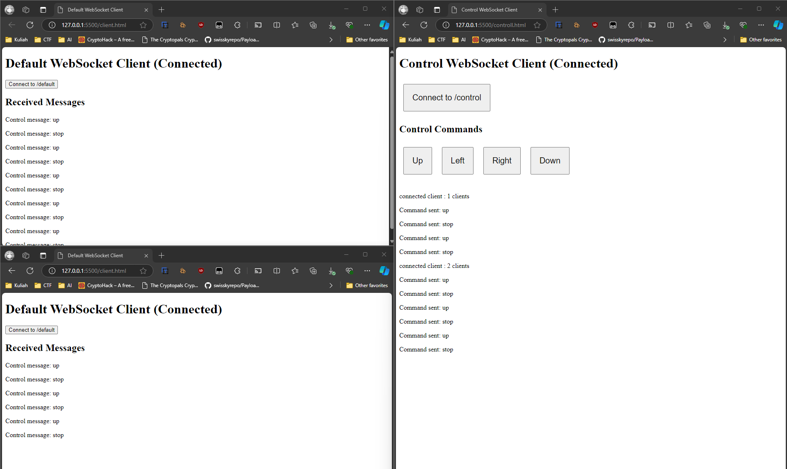

# WebSocket Control Server

This repository demonstrates how to use WebSocket to broadcast control states to connected clients. It features two endpoints: `/client` for clients and `/control` for the control interface.

## Overview

The server supports WebSocket connections for different endpoints:

- **Client Endpoint**: Connect to `/client` to receive messages.
- **Control Endpoint**: Connect to `/control` to send control messages that are broadcasted to all connected clients on the `/client` endpoint.



## Getting Started

### Prerequisites

- Node.js installed on your machine.

### Installation

Clone the repository:

   ```bash
   git clone <repository-url>
   cd <repository-directory>
   ```

### Running the Server

Start the server using Node.js:

```bash
node server.js
```

The server will listen on port 8080. You should see a message indicating that the server is running:

```
Server is listening on port 8080
```

### Connecting to the WebSocket

1. **Client**: Open `client.html` in your web browser. This will connect to the `/client` endpoint and listen for messages.

2. **Control**: Open `control.html` in another tab or browser. This will connect to the `/control` endpoint. You can send messages from this interface, which will be broadcasted to all connected clients on the `/client` endpoint.

## Code Explanation

```javascript
const WebSocket = require("ws");
const http = require("http");

// Create an HTTP server
const server = http.createServer((req, res) => {
  res.writeHead(200, { "Content-Type": "text/plain" });
  res.end("WebSocket Server is running");
});
```

- **HTTP Server**: This initializes an HTTP server that responds with a simple message indicating that the WebSocket server is running.

```javascript
// WebSocket server for '/default'
const wssClient = new WebSocket.Server({ noServer: true });

// WebSocket server for '/control'
const wssControl = new WebSocket.Server({ noServer: true });

// Store all connected clients for /default
const defaultClients = new Set();
```

- **WebSocket Servers**: Two WebSocket servers are created for different endpoints: `/client` and `/control`. A `Set` is used to keep track of all clients connected to the `/client` endpoint.

```javascript
// Handle WebSocket connections for '/default'
wssClient.on("connection", (ws) => {
  console.log("Client connected to /default");
  defaultClients.add(ws);

  ws.on("message", (message) => {
    console.log("Received from /default:", message);
    ws.send(`Echo from /default: ${message}`);
  });

  ws.on("close", () => {
    console.log("Client disconnected from /default");
    defaultClients.delete(ws);
  });
});
```

- **Client Connection Handling**: When a client connects to the `/client` endpoint, a message is logged, and the client is added to the `defaultClients` set. Incoming messages are echoed back to the client.

```javascript
// Handle WebSocket connections for '/control'
wssControl.on("connection", (ws) => {
  console.log("Client connected to /control");
  ws.send("connected client : " + wssClient.clients.size + " clients");

  ws.on("message", (message) => {
    console.log("Received from /control:", message);

    // Forward the control message to all clients connected to /default
    defaultClients.forEach((client) => {
      if (client.readyState === WebSocket.OPEN) {
        client.send(`Control message: ${message}`);
      }
    });

    // Respond to the control client
    ws.send(`Command sent: ${message}`);
  });

  ws.on("close", () => {
    console.log("Client disconnected from /control");
  });
});
```

- **Control Connection Handling**: When a client connects to the `/control` endpoint, it sends the number of connected clients. Incoming control messages are forwarded to all clients connected to the `/client` endpoint, and an acknowledgment is sent back to the control client.

```javascript
// Handle upgrade requests to decide which WebSocket server to use
server.on("upgrade", (request, socket, head) => {
  const { url } = request;

  if (url === "/client") {
    wssClient.handleUpgrade(request, socket, head, (ws) => {
      wssClient.emit("connection", ws, request);
    });
  } else if (url === "/control") {
    wssControl.handleUpgrade(request, socket, head, (ws) => {
      wssControl.emit("connection", ws, request);
    });
  } else {
    // If the endpoint doesn't match, destroy the connection
    socket.destroy();
  }
});
```

- **Upgrade Handling**: This listens for upgrade requests to determine which WebSocket server to use based on the URL. If the URL matches `/client` or `/control`, the corresponding WebSocket server handles the connection; otherwise, the socket is destroyed.

```javascript
// Start the HTTP server
server.listen(8080, () => {
  console.log("Server is listening on port 8080");
});
```

- **Server Start**: Finally, the HTTP server is started, and it begins listening for connections on port 8080.

